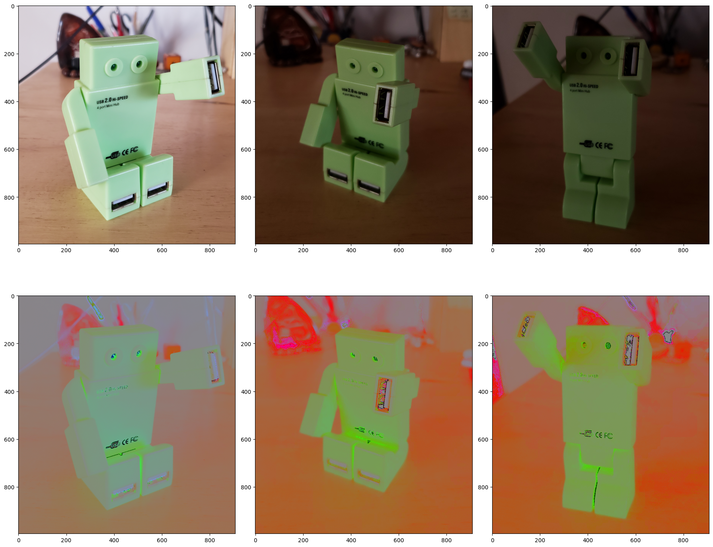
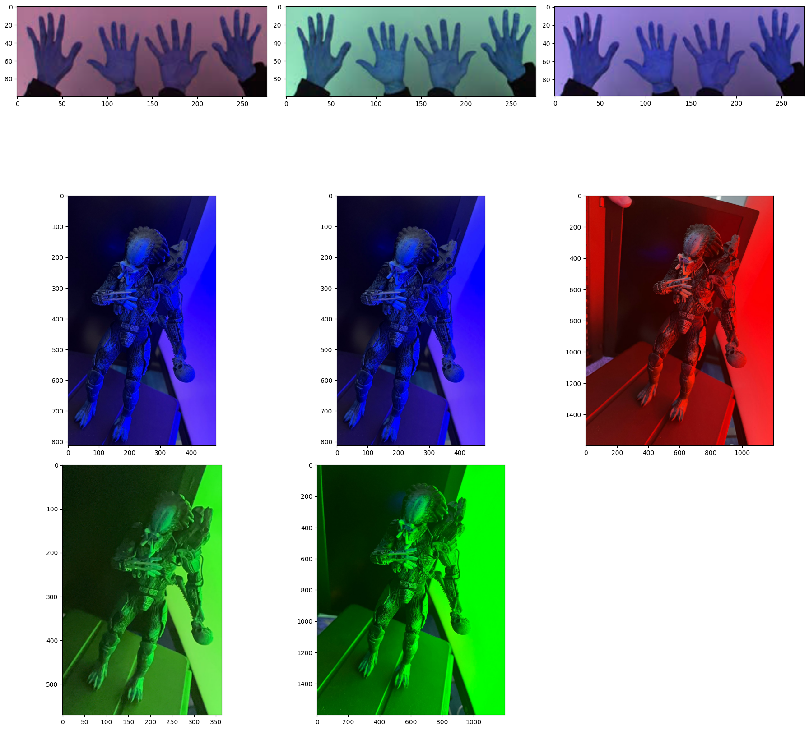
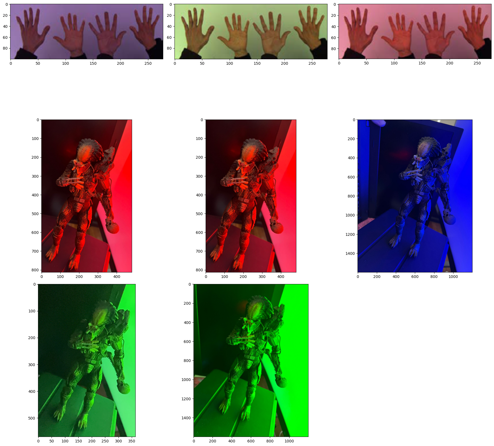
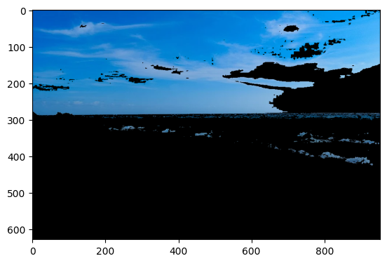
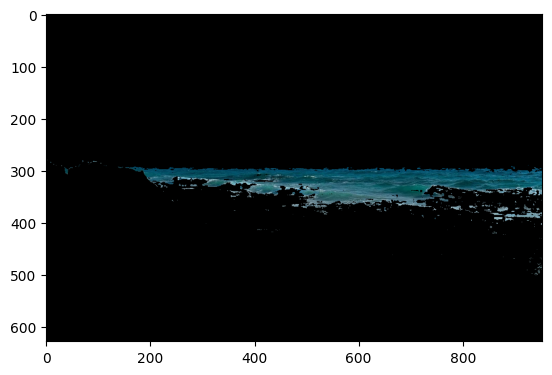
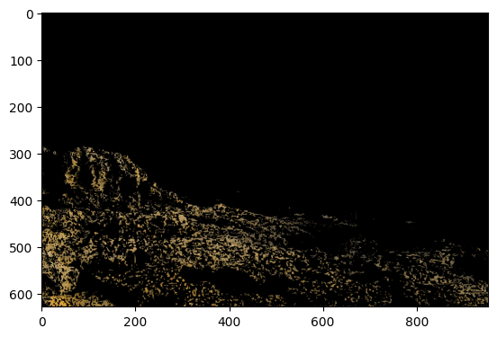

# Computer-vision White Patch and Chromatic Coordinates

In this project you will 

### Try this notebook

To start this project:

```python
python3 -m venv venv
source venv/bin/activate
pip install -r requirements.txt
```
### Chromatic Coordinates



### White Patch

Before White Patch



After White Patch




### Segmentation

original


segmentation only sky




segmentation only ocean




segmentation only rock


